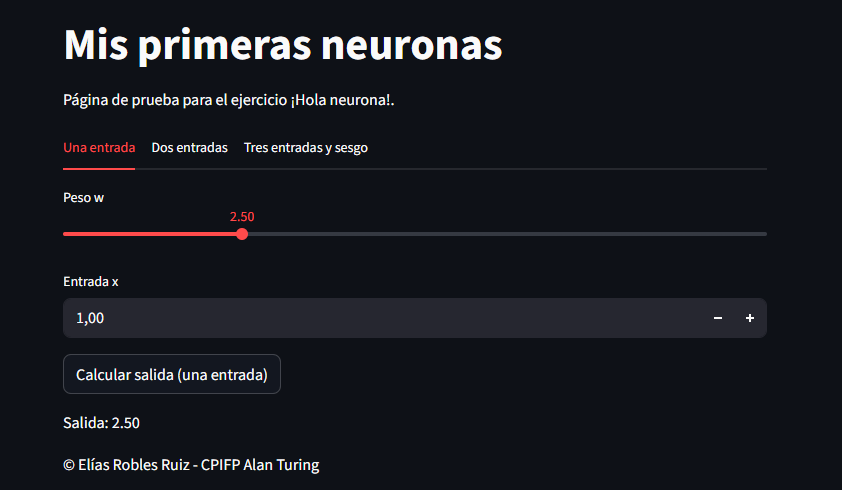
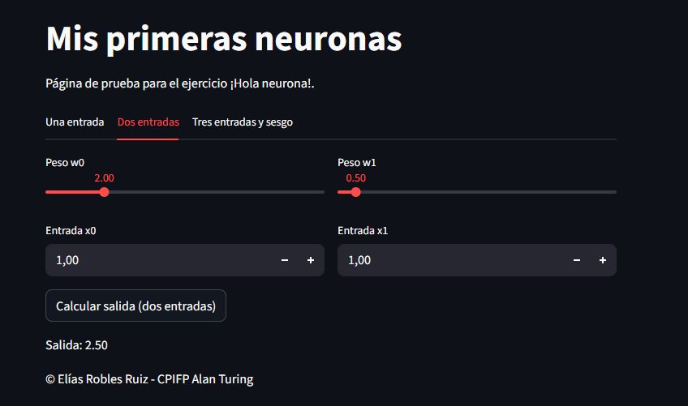
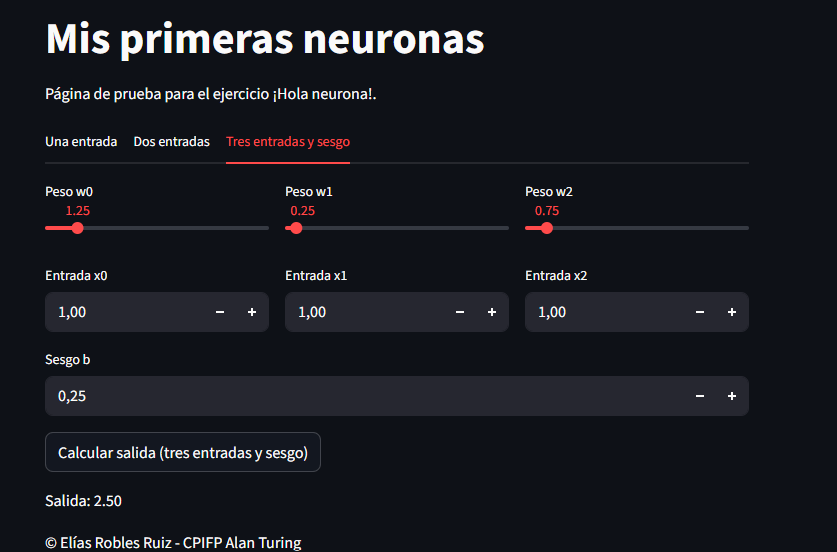

# 🧠 App de Neuronas con Streamlit

Este proyecto es una aplicación interactiva desarrollada con **Streamlit** para comprender el funcionamiento básico de una **neurona artificial** mediante el uso de pesos, entradas y sesgo.

La aplicación permite experimentar con:

- Una neurona con **una entrada**
- Una neurona con **dos entradas**
- Una neurona con **tres entradas y sesgo**

---

## 📸 Capturas de la aplicación

---

## 📁 Estructura del proyecto

.  
├── streamlit_app.py  
├── requirements.txt  
├── img/  
│ ├── neurona.png  
│ ├── image1.png  
│ ├── image2.png  
│ └── image3.png  
└── README.md  

- **streamlit_app.py**: aplicación principal en Streamlit  
- **requirements.txt**: dependencias del proyecto  
- **img/**: imágenes usadas en la app y capturas  
- **README.md**: documentación del proyecto  

---

## 🧪 Funcionamiento de la app

### 🟢 Pestaña 1: Una entrada

- Entrada x

- Peso w

- Salida: y = w · x

### 🟡 Pestaña 2: Dos entradas

- Entradas x0, x1

- Pesos w0, w1

- Salida: y = w0 · x0 + w1 · x1

### 🔵 Pestaña 3: Tres entradas y sesgo

- Entradas x0, x1, x2

- Pesos w0, w1, w2

- Sesgo b

- Salida: y = w0 · x0 + w1 · x1 + w2 · x2 + b

---

## 💡 Objetivo educativo

Esta aplicación tiene un objetivo educativo y sirve como introducción al concepto de neurona artificial, permitiendo visualizar cómo influyen los pesos y el sesgo en el resultado final.

---

## 🛠️ Tecnologías utilizadas

- Python 🐍
- Streamlit 📊

---

## 👥 Creditos

[Elías Robles Ruiz](https://github.com/eliasrrobles)
